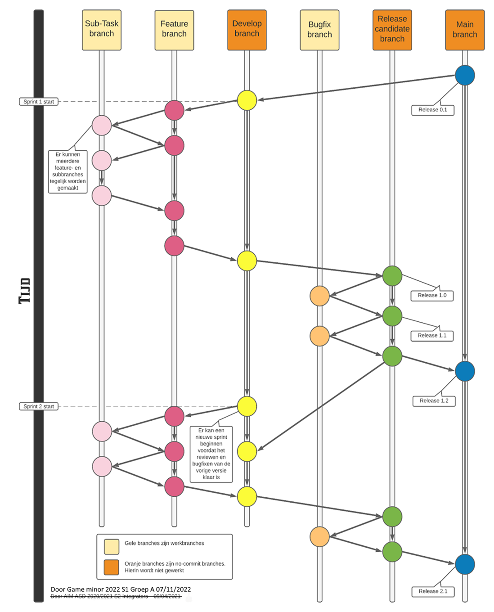
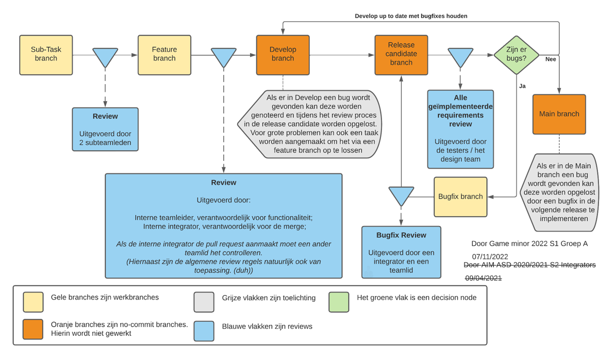

# A-Passing-Friend

## Workflow

## Review process

## Regels
### Branches
1.	'main' bevat een werkende versie van het systeem zonder bekende bugs of crashes.
2.	'develop' bevat een werkende WIP versie van het systeem.
3.	Als een feature niet af is, mag er ook geen pull request naar 'develop' gemaakt worden.
4.	Op 'main', 'develop' en 'release-candidate' wordt niet direct gecommit.
5.	'feature' branches zijn de werk branches voor groepeerbare functionaliteiten (features).
6.	'sub-task' branches worden gemaakt vanuit een 'feature' branch.
7.	'sub-task' branches zijn branches waarin een 'feature' branch in meerdere taken wordt verdeeld.
8.	'feature' branches worden gemaakt vanuit 'develop'.
9.	'bugfix' branches worden gemaakt vanuit een 'release-candidate' branch.
10.	'bugfix' branches worden gemerged naar de 'release-candidate' branch waar ze gemaakt zijn.
11.	Nadat een pull request is gemerged vanuit een ‘sub-task’ branch, dan moet de eigenaar deze ‘sub-task’ branch verwijderen.
12.	‘main’, ‘develop’ en ‘feature’ branches worden niet verwijderd.
13.	‘feature’ branches worden aangemaakt als ‘feature/<featureNummer>-<featureNaam>’.
14.	‘sub-task’ branches worden aangemakt als ‘sub-task/<featureNummer>-subtaskNaam’
### Reviewen
1.	Als een 'sub-task' branch aan de DoD en de gewenste functionaliteit voldoet wordt hiervoor een pull request aangemaakt naar de 'feature' branch.
2.	Als een 'feature' branch aan de DoD en de gewenste functionaliteit voldoet wordt hiervoor een pull request aangemaakt naar de 'develop' branch.
3.	Op de dinsdag dat integrators gaan integreren wordt een 'release-candidate' branch geopend vanuit 'develop'. Vanaf dat moment gaan geen nieuwe features meer mee naar de demo van Terrible Thursday.
4.	Als een 'release-candidate' branch is geopend en er zijn geen bugs meer (met uitzondering van bugs waar taken voor zijn aangemaakt) en het bevat alle gewenste functionaliteiten dan wordt hiervoor een pull request aangemaakt naar de 'main' branch.
5.	Als jij een taak af hebt dan moet jij alle taken die op dat moment binnen je subteam op 'in review' staan gaan reviewen, tenzij die taak al door twee subteamleden is gereviewd.
6.	Als je een pull request afkeurt moet je de taak terug naar 'to do’ slepen en notificeer je de eigenaar hiervan.
7.	Als een pull request is goedgekeurd mag deze alleen door de originele maker worden gemerged.
8.	Tijdens reviewen moet je letten op onderstaande punten, tenzij anders aangegeven in het review proces figuur:
a.	Voldoet het aan de bedoelde functionaliteit van de branch zoals beschreven in de post condities van de bijbehorende taak?
b.	Voldoet het aan de DoD?
c.	Gaat het pull request naar de goede branch?
### Commits
1.	Commit messages moeten in het Engels.
2.	Commit messages beginnen met een werkwoord.
3.	Commit messages moeten beschrijven wat je hebt gedaan, Mag: "Added x to y so z works", niet: "Add x to y" of "Fix for problem x".
### Algemeen
1.	Als iemand de develop breekt wordt de merge gerevert en mag (lees: moet) de groep die de merge heeft gemaakt het fixen.
2.	Er mag niet worden afgeweken van de regels die in dit bestand beschreven zijn.
3.	Als de integriteit van de repository is beschadigd mogen de integrators deze regels breken.
### Unity
1.	Alleen de Design Lead mag de aan de main unity scene werken.
2.	Alle unity bestanden zoals scripts, materials etc moeten in een folder komen en niet direct in de asset directory.
3.	We werken met de URP.
4.	We werken met Unity Editor Version 2022.1.14f1.
 
## Definition of Done
Om te bepalen of een taak als klaar gezien kan worden wordt gebruik gemaakt van een Definition of Done. Deze is verschillend voor documenten en code. 
### Code
•	Code voldoet aan de Code Style Guide.
•	Er is rekening gehouden met de CLEAN coding principles (zie Code Styleguide).
•	De code moet voldoen aan de post condities van de taak.
•	Alle code moet zonder extra uitleg te begrijpen zijn (voor programmeurs).
•	Alle code is gereviewd door minstens 2 personen (Zie reviewproces van de Git workflow guideline).
•	Alle code is in het Engels geschreven.
### Documenten
•	Alle documenten voldoen aan de AIM controlekaart (Onderwijsonline, z.d.).
•	Ten doorloop van het project zijn alle documenten en code consistent met elkaar.
•	Als er in een document een onderdeel van een ander document gebruikt wordt (bijvoorbeeld in het SDD use cases van het SRS) moet hier een verwijzing tussen zitten.
•	Documenten zijn door 2 personen gereviewd.
•	Documenten moeten voldoen aan de Documenten Style Guide.

